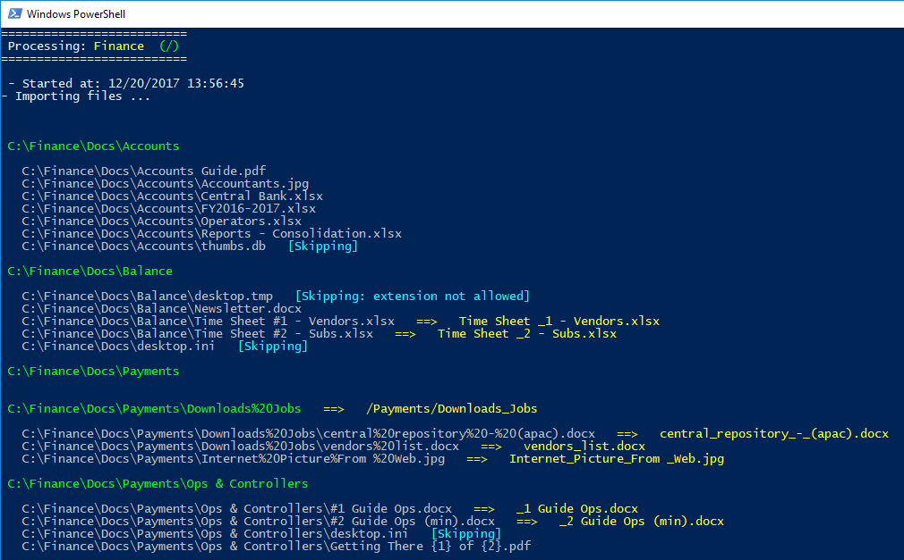
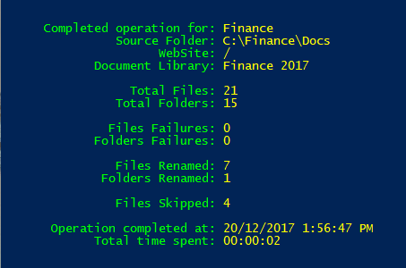
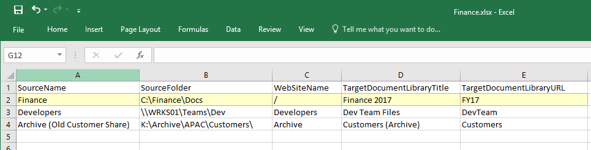

# SPOPSM 


**SharePoint Online PowerShell Migrator**

SPOPSM is a little script utility to simplify the process of migrating local files and network shars to SharePoint Online, preservaing metadata, replacing invalid characters, ignoring invalid files, and dealing with large files up to 15GB. It can be used to migrate one or more sources and automate long migrations, and also helps users to test their migration by generating reports before making any changes to SharePoint.

Finally an easy and open source solution aimed to simplify long and tedious migration jobs to SharePoint Online!


## Using the Script 

Simply call the script by passing your user name, a valid tenant url to SPO, point to a valid .csv files containing the source for the migration and hit enter!


**`.\SPOPSM.ps1 -SiteUrl https://adventureworks.sharepoint.com/sites/apac -CSVFile .\finance.csv`**

The command above will produce the following output:




With the migration complete, a summary will be displayed:




## The CSV File 

On our previous example, we migrated to **https://adventureworks.sharepoint.com/sites/apac**, the instructions used for the migration were placed in a **.csv file** (comma separated values), which specified the source for the file and the destination (the web where the document library is residing or will be created)



You can use any editor to create your own .csv files (Excel is probably the best option), the first line contains the column names, anything after are considered the values separated by commas, so a regular .csv file for only one source would look like the following:

**SourceName,SourceFolder,WebSiteName,TargetDocumentLibraryTitle,TargetDocumentLibraryURL**
**Finance,C:\Finance\Docs,/,Finance 2017,FY17**

The columns in the .CSV file are the following:

* **SourceName** = a friendly name for your source, it will be displayed during the migration

* **SourceFolder =** source containing your files and folders, it could be something like: **C:\Finance** - or a share like: **\\\wks01\ADMIN\Shared\FY17\Reports**

* **WebSiteName** = the destination for your migration, the script will look for a web named after this value, if you specify **Finance** the script will look a web called **"Finance"** under **https://adventureworks.sharepoint.com/sites/apac**, if you want to import within the same the root web, just leave blank or use a backslash **/** 

* **TargetDocumentLibraryTitle** = if there is no document library matched by **"TargetDocumentLibraryURL"**, a new document library will be created and this value will be used for its Title, for example: **"Finance 2017 Docs"** - this value is also used during the migration to provide a feedback to show where the files are being uploaded to.

* **TargetDocumentLibraryURL** = the physical name for the document library, if an existing name is matched, the migration will use the existing document library, otherwise a new document library will be created under **https://adventureworks.sharepoint.com/sites/apac**  using this value for the URL, for example: **"FY2017DOCS"**, which will result in **https://adventureworks.sharepoint.com/sites/apac/FY2017DOCS**


## Script Parameters


* **`-SiteUrl`** = [Required] address used to connect to SharePoint Online (tenant url), once the script connects to this address, it will migrate all the data to the specified sub webs specified in the .csv, example: **`-SiteUrl https://adventureworks.sharepoint.com`** 

* **`-UserName`** = [Optional] the SharePoint user name for the connection, example:  **`-UserName janefan@adventureworks.com`**, or use a variable: **`-UserName $creds.UserName`** (if not present, you will be prompted)

* **`-Password`** = [Optional] You can supply a password for the user account by using this parameter, for example: **`-Password 123XYZ`**, passwords will be sent as clear text and will exposed unless you use and encripted variable, for example: **`-Password $creds.Password`** (if not present, you will be prompted)

* **`-LogName`** = [Optional] this parameter when specified will point to a location and name for a log files, example: **`-LogName C:\Migration Logs\DevFiles`** - if this parameter is not present, no logs will be generated.

* **`-CSVFile`** = [Required] location and name of the .csv file containing the instructions for the migration, example: **`-CSVFile C:\DOCS\Source.csv`**

* **`-DoNotCreateLibraries`** = [Optional] when present, the script will NOT create any document libraries, it speeds up the execution by skipping the validations of existing document libraries, in other words, you know the contents of your migration and all uploads will find the respective document libraries already in the server, skipping the need to creating new ones

* **`-DoNotCreateFolders`** = [Optional] similar to document libraries, in this case assuming the document library is present, the script will transform the migration of complex folder structures into a flat structure, very useful for environmentS based on metadata navigation instead of complex folder structures. (In this current version my script is not handling duplicated files, causing them to be overwritten - for future release I will add increments to file names to avoid this issue.)

* **`-DoNotPerformUploads`** = [Optional] when present, no files will be created in the tenant, it causes the **soft upload** when combined with **-DoNotCreateLibraries** and **-DoCreateFolders**, if the other parameters are not present and this one is present, you will get the creation of document libraries and folders but no files uploaded

* **`-UserName`** SharePoint User Name

Combining parameters:

You can generate a **soft upload** (migration [preview]), folders and files will not be created on SharePoint, the screen output will show what an import will look like and the results are captured to a log file called **Finance.log** (another file called **Finance.html** is also generated as a copy of the console output in HTML format).

```
$url = "https://adventureworks.sharepoint.com/sites/Finance"
$csv = "C:\Jobs\finance.csv"
$log = "X:\Migration Project\Finance\Logs\Finance-Archive-Log"
$creds = Get-Credential

.\SPOPSM.ps1 -LogName $log -CSVFile $csv -UserName $creds.Username -Password $creds.Password -SiteUrl $url  -DoNotCreateLibraries -DoNotCreateFolders -DoNotPerformUploads
```

With fewer parameters (the script will prompt the user for credentials):

```
.\SPOPSM.ps1 -SiteUrl https://adventureworks.sharepoint.com/sites/apac -CSVFile .\finance.csv
```


## Validations


* **Invalid file types** = the script will ignore **.tmp, .ds_store, .aspx, .asmx, .ascx, .master, .xap, .swf, .jar, .xsf, .htc**, you can customise this list.

* **Invalid characters** = the following group of characters: **%20** and **"?<>#%** are replaced by underline **_** (there is a function called ValidateName() and it can be customised to meet your requirements, another function called ValidateDocumentLibraryName() was left for future expansions)


## Cloning the Repo

```
    git clone https://github.com/MrDrSushi/SPOPSM.git
```