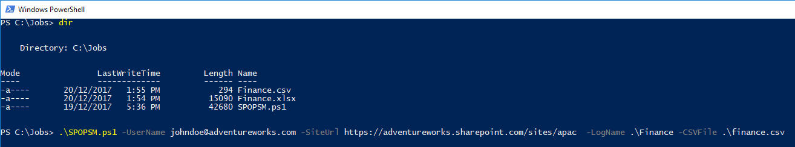

# SPOPSM

**SharePoint Online PowerShell Migrator**

Finally a PowerShell script aimed to simplify the migration of network shares and local folders to SharePoint Online!

Files migrated will have have their metadata preserved along with its original folder structure, it will validate the source, ignoring invalid files such as **.tmp, .ds_store, .aspx, .asmx, .ascx, .master, .xap, .swf, .jar, .xsf, .htc**, it will also replace invalid characters found in files and/or folders avoiding any interruptions during the migration, while supporting files up to 15GB.

There is also **"soft upload"** mode, which creates a report which files and folders will be renamed for containing invalid characters, and what will be ignored during the migration. 

## Using the Script

Given the following command line below:

It will run the script using the credentials from `johndoe@adventureworks.com` to migrate the files specified in the .csv file `C:\Jobs\finance.csv` to the tenant `https://adventureworks.sharepoint.com/sites/dev`, the operation will also record a log to a file in `C:\Jobs\Finance`

## The CSV File
Let's say we want to migrate the folder **C:\Finance\Docs** to a document library called **"Finance 2017"** to our tenant at **https://adventureworks.sharepoint.com/sites/apac** - we need to create a .csv file and include a line like in the example below, this will instruct the script to import the contents associated with the line **Finance Files** into SharePoint to a root web into a document library called **"Finance 2017"**, along with the other lines to their respective destinations.

In the example below we are importing three different sources but you can simply import one line at a time if you want to work in smaller import projects. I would recommend to take the example below for your migration projects, 

SourceName | SourceFolder | WebSiteName | TargetDocumentLibraryTitle | TargetDocumentLibraryURL
---------- | ------------ | ----------- | -------------------------- | ------------------------
Dev Team (Legacy)|\\\Works\Dev\P\PRJ|Development|Projects|Projects
**Finance Files**|**C:\Finance\Docs**|/|**Finance 2017**|**Finance**
Sales (Old Stuff)|\\\Customers\Bids|Commercial|Sales (Archived)|Sales2016

The .CSV file can contain one or more lines, where each line will contain the a source and a destination to be imported to SharePoint.

SourceName,SourceFolder,WebSiteName,TargetDocumentLibraryTitle,TargetDocumentLibraryURL
Samples,C:\Migrations\Samples\Miscelanea,/,Migration Samples,Samples

The columns above are the following:

* **SourceName** = a friendly name for your source, it will be displayed during the migration

* **SourceFolder =** source folder containing your files and folders, it could be something like: **C:\Finance** - or a share like: **\\\wks01\ADMIN\Shared\FY17\Reports**

* **WebSiteName** = the destination on SharePoint Online for your migration, the script will look for a web named after this value, for example, if you specify "Finance" (no quotes needed) the script will look this web called **"Finance"** under https://adventureworks.sharepoint.com, if you want to import within the same the root web, just leave blank or use a backslash **(/)**

* **TargetDocumentLibraryTitle** = if the script can't find a document library matched by **"TargetDocumentLibraryURL"**, a new document library will be create and this value will be used for its Title, for example: **"Finance 2017 Docs"**

* **TargetDocumentLibraryURL** = the physical name for the document library, if an existing name is matched, the migration will reuse the library, otherwise a new document library will be created using this name for the URL, for example: **"FY2017DOCS"**

## Aditional Parameters

`-Password` You can supply a password by using the this parameter, for example: `-Password 123XYZ`, it will be sent as clear text and will expose your password for anybody, or you can use a variable with the encripted text, for example: `-Password $ENCPASSWORD`. This parameter allows you to automate the script execution skipping the prompt for your password, and should be used with caution to not expose your credential.

`-LogName` location and name of the log file, if not specified, no logs will be generated

`-CSVFile` location and name of the CSV FILE containing the instructions for the migration

`-UserName` SharePoint User Name

`-SiteUrl` URL of the Target WebSite (Top Level)

You can generate a soft upload (a preview of a migration):

`
.\SPOPSM.ps1 -LogName .\Finance -CSVFile C:\Jobs\finance.csv -UserName johndoe@adventureworks.com -SiteUrl https://adventureworks.sharepoint.com/sites/dev  -DoNotCreateLibraries -DoNotCreateFolders -DoNotPerformUploads
`

In the example above, no document libraries, folder and files will be created on SharePoint, the screen output will show what an import will look like and the results are captured to a log file called **Finance.log** (another file called **Finance.html** is also generated, this is a copy of the console output in HTML format)

## Cloning the Repo

`git clone https://github.com/MrDrSushi/SPOPSM.git`